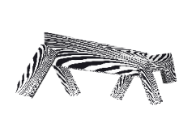

# WebGL 3D Model Animation

## Description 
-------
A single page application that use WebGL to animate some 3D articulated models, they are a Zebra, a Crocodile, and a Robot.

For more documentation detail, you could refer to this file `docs/Laporan IF3260 Tugas Besar 3.pdf`

## Requirement 
-------

1. Select one of these as server:
   - Node.js with express lib
   - Live server extension of VS Code
   - Other method that you prefer to run static file  
  **(NOTE: javascript files are used as module, so it might be tricky)**

2. Browser to run/use static file, I recommended to use latest version of Chrome or Firefox as these two have been tested  
  **(NOTE: some browser might be incompatible with WebGL API that being used)**
   

## How to Run
-------
To run the app are pretty simple, could be describes as these steps

1. Run the server (with the way you choose) to host the files at `public` folder
   
2. Open the browser to open `index.html`
   

## Features
-------

1. Texturing/mapping & shading, there are 3 type
   - Image texture mapping of the zebra
   - Environment mapping of the crocodile
   - Bump mapping of the robot  
   this could be toggled on/off

   

   

2. Animation, yeah these model are moving, and you could toggle it on/off

3. Setting camera's point of view, by it's distance/radius and it's angle

    

4. Save & load models state, data is saved in JSON format

    

    

5. Help

    
   

## Issues
-------
No significant issue have been found yet.

## Contributors
-------

1. [Naufal Prima Yoriko](https://github.com/primayoriko)
   
2. [Faris](https://github.com/darkGrimoire)
   
3. [Yasyfiana](https://github.com/yasyfiana)
